# Adaptive Database Framework

A self-adaptive database framework that autonomously ingests a live JSON data stream, infers field types, classifies every field into **MySQL** (structured) or **MongoDB** (semi-structured), and routes records to the appropriate backend — all without hardcoded schemas.

---

## Overview

This framework solves the problem of handling heterogeneous JSON data streams where schema is unknown or evolving. Instead of requiring predefined schemas, the system:

1. **Observes** incoming data to learn field patterns (types, presence rates, nesting)
2. **Classifies** each field as SQL-suitable or document-suitable using heuristics
3. **Routes** records to MySQL and/or MongoDB based on classification
4. **Adapts** to schema evolution with automatic type widening and migrations

### Key Capabilities

| Capability | Description |
|---|---|
| **Dynamic Schema Inference** | No predefined schemas — field types discovered from data |
| **Adaptive Placement** | Heuristic rules decide SQL vs MongoDB per field |
| **Cross-DB Linking** | `username` + `sys_ingested_at` stored in both backends for joins |
| **Upsert Handling** | Automatic primary key detection; updates existing records instead of duplicating |
| **Crash Recovery** | JSONL write-ahead log ensures no data loss on failure |
| **Type Widening** | Automatic INT→BIGINT, VARCHAR(50)→VARCHAR(255) migrations |
| **Metadata Persistence** | Classification decisions survive process restarts |

---

## Architecture

The codebase is organized into **4 topics** + a central orchestrator:

```
                         ┌──────────────────┐
                         │  Data Stream API │
                         │  (FastAPI :8000) │
                         └────────┬─────────┘
                                  │  raw JSON records
                                  ▼
 ┌────────────────────────────────────────────────────────────┐
 │                    IngestAndClassify                       │
 │                                                            │
 │  ┌──────────────────────────────────────────────────┐      │
 │  │ TOPIC 1 — NORMALIZATION              src/normalization/ │
 │  │  TypeDetector · RecordNormalizer                │      │
 │  └──────────────────┬───────────────────────────────┘      │
 │                     │ normalized records                    │
 │                     ▼                                       │
 │          ┌─────────────────────┐                            │
 │          │  BUFFER + WAL       │  crash-safe staging        │
 │          │  (pending.jsonl)    │                            │
 │          └─────────┬───────────┘                            │
 │                    │ flush (size/timeout)                   │
 │                    ▼                                        │
 │  ┌──────────────────────────────────────────────────┐      │
 │  │ TOPIC 2 — ANALYSIS & CLASSIFICATION  src/analysis/      │
 │  │  FieldAnalyzer · FieldStats · Classifier         │      │
 │  └──────────────────┬───────────────────────────────┘      │
 │                     │ decisions                             │
 │                     ▼                                       │
 │  ┌──────────────────────────────────────────────────┐      │
 │  │ TOPIC 3 — STORAGE                   src/storage/        │
 │  │  MySQLClient · MongoClient · RecordRouter        │      │
 │  └──────────────────┬───────────────────────────────┘      │
 │                     │                                       │
 │                     ▼                                       │
 │  ┌──────────────────────────────────────────────────┐      │
 │  │ TOPIC 4 — PERSISTENCE               src/persistence/   │
 │  │  MetadataStore                                   │      │
 │  └──────────────────────────────────────────────────┘      │
 └────────────────────────────────────────────────────────────┘
```

---

## Module Reference

### Topic 1: Normalization (`src/normalization/`)

Handles type detection, coercion, and record preprocessing before analysis.

#### TypeDetector

Detects semantic types from raw values beyond basic Python types.

| Detected Type | Description | Example |
|---------------|-------------|---------|
| `int` | Integer numbers | `42`, `"123"` (coerced) |
| `float` | Floating point numbers | `3.14`, `"2.5"` (coerced) |
| `bool` | Boolean values | `true`, `"yes"` (coerced) |
| `str` | Plain strings | `"hello world"` |
| `ip` | IPv4/IPv6 addresses | `"192.168.1.1"`, `"::1"` |
| `uuid` | UUID strings | `"550e8400-e29b-41d4-a716-446655440000"` |
| `datetime` | ISO 8601 timestamps | `"2024-01-15T10:30:00Z"` |
| `array` | Lists/arrays | `[1, 2, 3]` |
| `object` | Nested dictionaries | `{"key": "value"}` |
| `null` | Null/None values | `null`, `"none"`, `""` |

**Type Coercion**: Automatically converts strings to their semantic types when detected (e.g., `"123"` → `123`, `"true"` → `True`).

#### RecordNormalizer

Processes raw JSON records before buffering:

1. **Flattens nested structures** using underscore notation (`metadata.version` → `metadata_version`)
2. **Coerces string values** to detected semantic types
3. **Injects `sys_ingested_at`** timestamp for bi-temporal tracking
4. **Tracks coercion metadata** for debugging (successful/failed coercions)

---

### Topic 2: Analysis & Classification (`src/analysis/`)

Observes field patterns and makes placement decisions.

#### FieldStats

Data class that accumulates statistics for a single field:

| Attribute | Description |
|-----------|-------------|
| `presence_count` | Number of records containing this field |
| `type_counts` | Dictionary of type → count (e.g., `{"int": 45, "str": 3}`) |
| `null_count` | Number of null/None values observed |
| `unique_values` | Set of unique values (capped at 1000 for memory) |
| `is_nested` | True if value is dict or list |
| `sample_values` | Small list of example values for debugging |

**Computed Properties**:
- `dominant_type`: Most frequently observed type
- `type_stability`: `count(dominant_type) / total_observations` — measures consistency
- `unique_ratio`: `unique_values / presence_count` — measures cardinality
- `presence_ratio`: `presence_count / total_records` — measures sparsity

#### FieldAnalyzer

The observation engine that accumulates FieldStats across batches:

- `analyze_batch(records)`: Process a batch of records, updating stats for each field
- Flattens nested structures into dot-notation keys (e.g., `metadata.sensor_data.version`)
- Handles arrays of objects by flattening the first element as representative

#### Classifier

Applies heuristic rules to produce `PlacementDecision` for each field:

| Rule | Condition | Backend |
|------|-----------|---------|
| 1 | Field is `username`, `sys_ingested_at`, or `t_stamp` | **BOTH** |
| 2 | Value is nested (dict or list) | **MongoDB** |
| 3 | `presence_ratio ≥ 70%` AND `type_stability ≥ 90%` | **SQL** |
| 4 | Everything else | **MongoDB** |

**SQL Type Mapping**:

| Detected Type | MySQL Type |
|---------------|------------|
| `int` | `BIGINT` |
| `float` | `DOUBLE` |
| `bool` | `BOOLEAN` |
| `str` | `VARCHAR(255)` |
| `ip` | `VARCHAR(45)` |
| `uuid` | `CHAR(36)` |
| `datetime` | `DATETIME` |
| default | `TEXT` |

#### Primary Key Selection

After classification, the Classifier automatically determines the best primary key:

| Criteria | Requirement |
|----------|-------------|
| Backend | Must go to SQL (`Backend.SQL` or `Backend.BOTH`) |
| Presence | **Must be present in 100% of records** (not nullable) |
| Uniqueness | Must have `≥70%` unique values |
| Type | Must be scalar (not array/object) |
| Name | Excludes timestamp-like fields (`*_at`, `*time`, `*date`) |

**Scoring**: `score = id_bonus (0.2 if name contains 'id'/'username'/'key') + (unique_ratio × 0.8)`

The highest-scoring candidate becomes the primary key, enabling upsert (update-or-insert) behavior.

#### PlacementDecision

Output data class for each field:

| Attribute | Description |
|-----------|-------------|
| `field_name` | Canonical field name |
| `backend` | `Backend.SQL`, `Backend.MONGODB`, or `Backend.BOTH` |
| `sql_type` | MySQL column type (e.g., `"BIGINT"`, `"VARCHAR(255)"`) |
| `canonical_type` | Detected semantic type |
| `is_nullable` | Whether SQL column allows NULL |
| `is_unique` | Whether SQL column has UNIQUE constraint |
| `is_primary_key` | Whether this field is the primary key |
| `reason` | Human-readable explanation for the decision |

---

### Topic 3: Storage (`src/storage/`)

Handles database connections and record routing.

#### MySQLClient

Manages MySQL connection with dynamic schema creation:

| Method | Description |
|--------|-------------|
| `connect()` | Establish connection, create database if missing |
| `ensure_table(table, decisions)` | Create table or ALTER to add new columns |
| `insert_batch(table, records, pk)` | Batch upsert (INSERT ... ON DUPLICATE KEY UPDATE) |
| `alter_column_type(table, col, type)` | Widen column type for migrations |
| `drop_column(table, col)` | Remove column when field moves to MongoDB |
| `get_current_columns(table)` | Query INFORMATION_SCHEMA for existing schema |

**Dynamic DDL**: Tables are created/modified at runtime based on `PlacementDecision`. No predefined schema required.

#### MongoClient

Manages MongoDB connection with schema-flexible document storage:

| Method | Description |
|--------|-------------|
| `connect()` | Establish connection |
| `ensure_indexes(collection, key_field)` | Create unique index on key field for upserts |
| `insert_batch(collection, docs, key)` | Batch upsert using `replace_one` with upsert=True |
| `find(collection, query)` | Query documents |

**Upsert Behavior**: When a document with the same key field value exists, it's replaced rather than duplicated.

#### RecordRouter

Splits records between backends based on decisions:

1. For each record, split into `sql_part` and `mongo_part`:
   - `Backend.SQL` → sql_part only
   - `Backend.MONGODB` → mongo_part only
   - `Backend.BOTH` → both parts
   - Unknown fields → mongo_part (safe default)

2. Batch upsert sql_parts to MySQL
3. Batch upsert mongo_parts to MongoDB

**Primary Key Handling**: Uses the classifier's primary key for upsert matching. Falls back to first unique non-timestamp field for MongoDB if needed.

#### Migrator

Handles schema evolution when types change:

| Migration Type | Example | Action |
|----------------|---------|--------|
| Type widening (safe) | INT → BIGINT | `ALTER TABLE ... MODIFY COLUMN` |
| Type widening (safe) | VARCHAR(50) → VARCHAR(255) | `ALTER TABLE ... MODIFY COLUMN` |
| Backend change | MongoDB → SQL | Copy data from MongoDB to new SQL column |
| Backend change | SQL → MongoDB | Copy data from SQL column, then DROP COLUMN |

**Type Widening Rules**:
- `int` → `bigint` → `float` → `str` (progressively wider)
- String types widen by length

---

### Topic 4: Persistence (`src/persistence/`)

Saves framework state to survive restarts.

#### MetadataStore

Persists all metadata to JSON files:

| File | Contents |
|------|----------|
| `decisions.json` | `field_name → PlacementDecision` mapping |
| `field_stats.json` | `field_name → FieldStats` statistics |
| `state.json` | Total records processed, last flush time, version |

**Methods**:
- `save_decisions()` / `load_decisions()`: Persist/restore placement decisions
- `save_field_stats()` / `load_field_stats()`: Persist/restore accumulated statistics
- `save_state()` / `load_state()`: Persist/restore pipeline state
- `save_all()` / `load_all()`: Convenience methods for full state

**Crash Recovery**: On restart, the pipeline loads previous state and resumes without re-analyzing historical data.

---

### Orchestrator (`src/ingest_and_classify.py`)

The main `IngestAndClassify` class ties all topics together:

```python
IngestAndClassify
├── Topic 1: TypeDetector, RecordNormalizer
├── Topic 2: FieldAnalyzer, Classifier
├── Topic 3: MySQLClient, MongoClient, RecordRouter
└── Topic 4: MetadataStore
```

**Public API**:

| Method | Description |
|--------|-------------|
| `ingest(record)` | Process single record: normalize → WAL → buffer |
| `ingest_batch(records)` | Process multiple records |
| `flush()` | Analyze buffer → classify → route → persist → clear |
| `get_decisions()` | Return current placement decisions |
| `get_field_stats()` | Return accumulated field statistics |
| `get_status()` | Return pipeline status (buffer size, total records) |
| `close()` | Disconnect from databases |

**Write-Ahead Log (WAL)**:
1. Every ingested record is appended to `metadata/pending.jsonl` *before* buffering
2. On successful flush, the WAL is cleared
3. On restart, pending records are recovered and reprocessed

---

### Configuration (`src/config.py`)

Loads settings from environment variables / `.env` file:

```python
AppConfig
├── MySQLConfig (host, port, user, password, database)
├── MongoConfig (host, port, database, user, password)
├── BufferConfig (buffer_size, timeout, wal_file)
├── data_stream_url
└── metadata_dir
```

---

## Screenshots

### Data Streaming
| | |
|:---:|:---:|
| 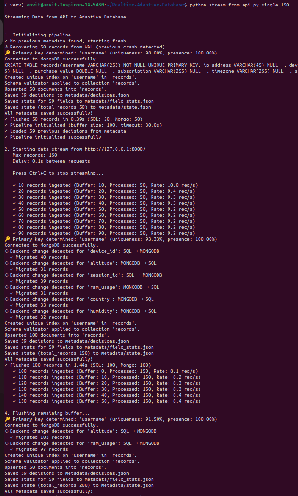 | 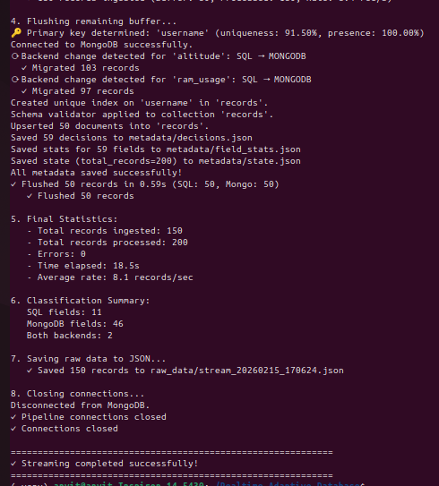 |
| *Initial ingestion phase* | *Continued real-time processing* |

### MySQL Storage
| | | |
|:---:|:---:|:---:|
| 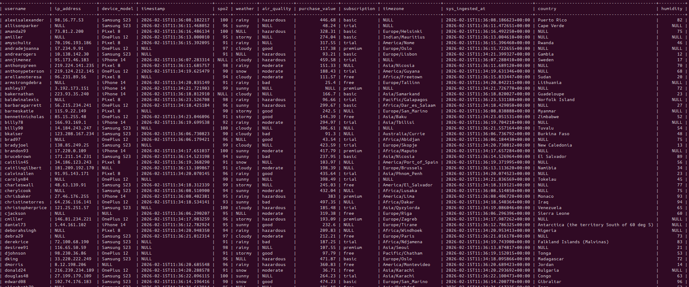 | 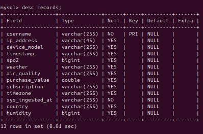 | 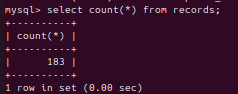 |
| *Stored records* | *Dynamically created schema* | *Record count* |

### MongoDB Storage
| | | |
|:---:|:---:|:---:|
| 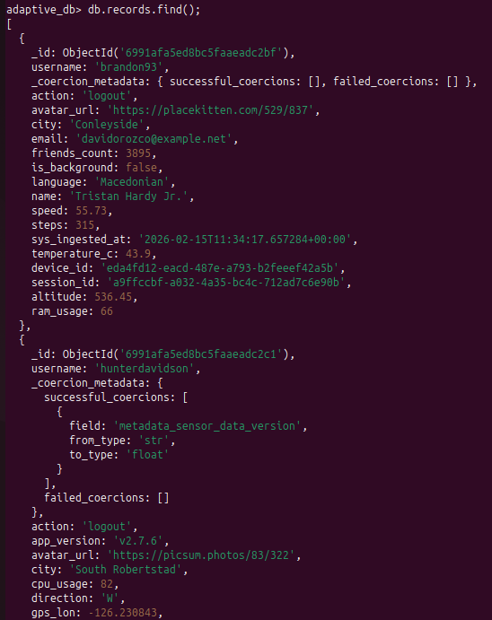 | 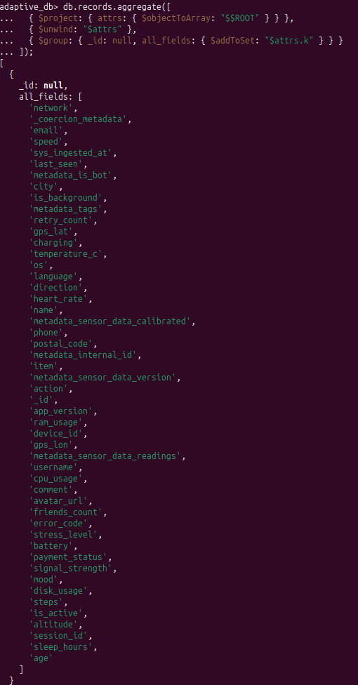 | 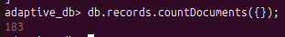 |
| *Stored documents* | *Document structure* | *Document count* |

### Metadata Persistence
| | | |
|:---:|:---:|:---:|
| 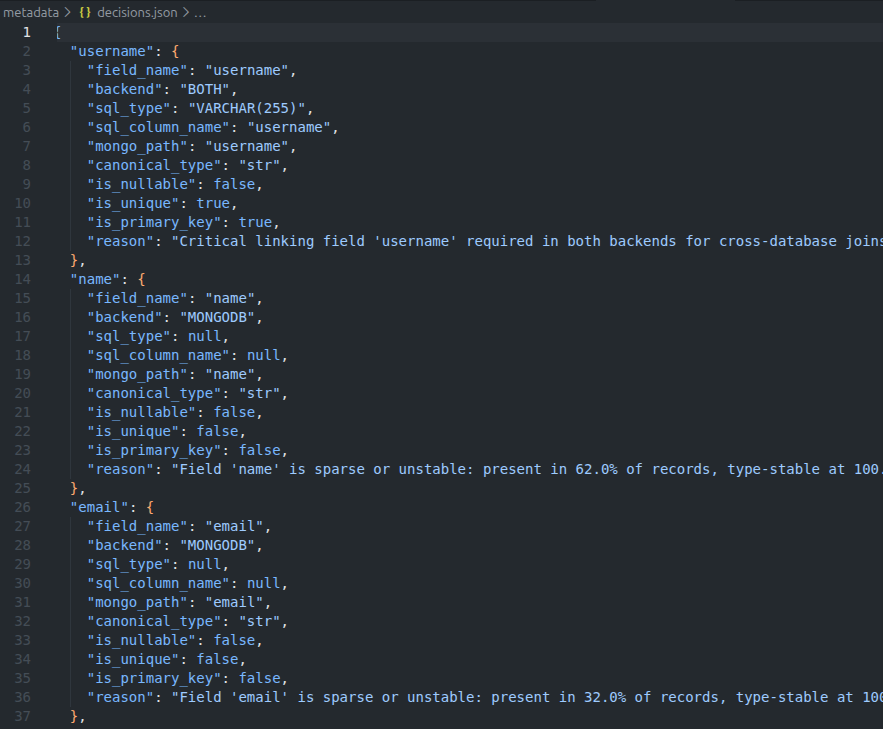 | 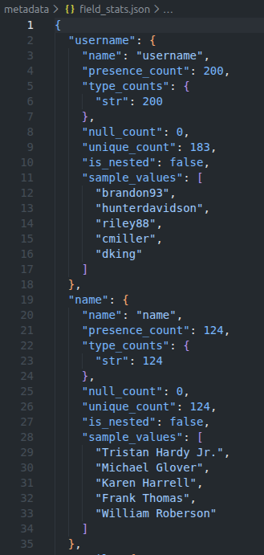 | 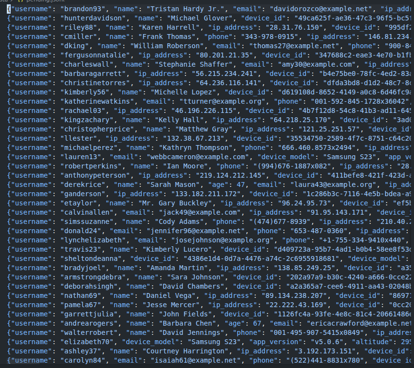 |
| *decisions.json* | *field_stats.json* | *pending.jsonl (WAL)* |

---

## Quick Start

### Prerequisites

- **Python 3.12+**
- **Docker & Docker Compose**

### 1. Clone and Navigate

```bash
git clone https://github.com/rajmodi8905/Realtime-Adaptive-Database.git
cd Realtime-Adaptive-Database
```

### 2. Start Databases

```bash
docker-compose up -d
docker ps  # Verify: adaptive_db_mysql, adaptive_db_mongodb
```

### 3. Install Dependencies

```bash
pip install -r requirements.txt
```

### 4. Test the Pipeline

```bash
python test_pipeline.py
```

### 5. (Optional) Stream Live Data

```bash
python stream_from_api.py
```

---

## Database Management

### MySQL
```bash
docker exec -it adaptive_db_mysql mysql -uroot -prootpassword adaptive_db
```
```sql
SHOW TABLES;
DESCRIBE records;  -- See dynamically created schema
SELECT * FROM records LIMIT 10;
```

### MongoDB
```bash
docker exec -it adaptive_db_mongodb mongosh adaptive_db
```
```javascript
db.records.find().limit(10)
db.records.countDocuments()
db.records.getIndexes()
```

---

## Programmatic Usage

```python
from src.ingest_and_classify import IngestAndClassify

pipeline = IngestAndClassify()

records = [
    {"username": "alice", "age": 30, "metadata": {"level": 5}},
    {"username": "bob", "score": 95.5, "tags": ["python", "ml"]}
]

pipeline.ingest_batch(records)
result = pipeline.flush()

# Inspect decisions
for field, decision in pipeline.get_decisions().items():
    print(f"{field} → {decision.backend.name} ({decision.reason})")

pipeline.close()
```

---

## Project Structure

```
.
├── src/
│   ├── normalization/               # Topic 1
│   │   ├── type_detector.py         #   Semantic type detection
│   │   └── record_normalizer.py     #   Flatten, coerce, timestamp
│   │
│   ├── analysis/                    # Topic 2
│   │   ├── field_stats.py           #   Per-field statistics
│   │   ├── field_analyzer.py        #   Observation engine
│   │   ├── decision.py              #   PlacementDecision, Backend
│   │   └── classifier.py            #   Heuristic rules
│   │
│   ├── storage/                     # Topic 3
│   │   ├── mysql_client.py          #   Dynamic DDL, upserts
│   │   ├── mongo_client.py          #   Document storage
│   │   ├── record_router.py         #   Split & route records
│   │   └── migrator.py              #   Type widening
│   │
│   ├── persistence/                 # Topic 4
│   │   └── metadata_store.py        #   JSON persistence
│   │
│   ├── config.py                    # Configuration
│   ├── ingest_and_classify.py       # Main orchestrator
│   └── pipeline.py                  # Streaming wrapper
│
├── metadata/                        # Persisted state
│   ├── decisions.json
│   ├── field_stats.json
│   ├── state.json
│   └── pending.jsonl                # WAL
│
├── docker-compose.yml
├── requirements.txt
└── test_pipeline.py
```

---

## Configuration

Environment variables (`.env`):

```bash
MYSQL_HOST=localhost
MYSQL_PORT=3306
MYSQL_USER=root
MYSQL_PASSWORD=rootpassword
MYSQL_DATABASE=adaptive_db

MONGO_HOST=localhost
MONGO_PORT=27017
MONGO_DATABASE=adaptive_db

BUFFER_SIZE=50
BUFFER_TIMEOUT=30.0

DATA_STREAM_URL=http://localhost:8000/GET/record
```

---

## Troubleshooting

### Reset Everything
```bash
rm -rf metadata/
docker-compose down -v
docker-compose up -d
```

### Check Logs
```bash
docker-compose logs mysql
docker-compose logs mongodb
```

---

## Key Dependencies

| Package | Purpose |
|---------|---------|
| `pymysql` | MySQL connector |
| `pymongo` | MongoDB driver |
| `python-dotenv` | Environment configuration |
| `requests` | HTTP client for data streams |

---

## Course Information

**Course:** CS432 Databases (Spring 2026)  
**Track:** Track 2 - Adaptive Database Framework
